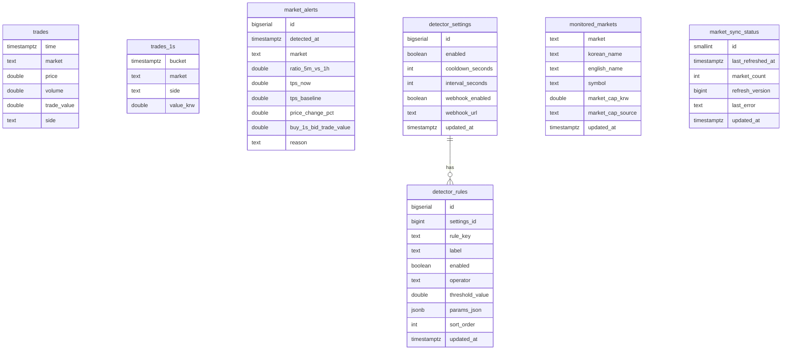

# DB Schema

이 문서는 현재 `upbit-monitor` 프로젝트의 데이터베이스 스키마 구조를 한 번에 이해하기 위한 정리 문서다.  
기준은 현재 코드와 SQL 파일:

- [initdb/001-trades.sql](/Users/yoo/workspace/upbit-monitor/upbit-monitor/initdb/001-trades.sql)
- [initdb/002-market-alerts.sql](/Users/yoo/workspace/upbit-monitor/upbit-monitor/initdb/002-market-alerts.sql)
- [initdb/003-trades-1s.sql](/Users/yoo/workspace/upbit-monitor/upbit-monitor/initdb/003-trades-1s.sql)
- [app/common/schema.py](/Users/yoo/workspace/upbit-monitor/upbit-monitor/app/common/schema.py)

## 개요

현재 DB는 크게 4개 영역으로 나뉜다.

1. 원본 거래 데이터 저장
2. 빠른 조회를 위한 1초 집계
3. 감지기 설정과 알림 이력 저장
4. 모니터링 대상 종목 목록과 동기화 상태 저장

## 전체 구조



## 데이터 흐름

```text
Upbit WebSocket
  -> trades

trades
  -> trades_1s
  -> detector 계산 입력

detector
  -> detector_settings / detector_rules 읽기
  -> market_alerts 기록

market-sync
  -> monitored_markets 갱신
  -> market_sync_status 갱신

Grafana
  -> trades / trades_1s / market_alerts / monitored_markets 조회
```

## 테이블 상세

### 1. `trades`

원본 체결 데이터 저장소다. 업비트에서 들어오는 실시간 거래를 그대로 적재한다.

컬럼:

- `time`: 체결 시각
- `market`: 종목 코드. 예: `KRW-BTC`
- `price`: 체결 가격
- `volume`: 체결 수량
- `trade_value`: 체결 대금. 보통 `price * volume`
- `side`: 체결 방향. `BID` 또는 `ASK`

특징:

- Timescale hypertable
- 시간축 기준으로 가장 큰 원본 테이블
- retention policy로 최근 30일만 유지 가능

현재 주요 인덱스:

- `idx_trades_time_market`
- `idx_trades_time_side_market`
- `idx_trades_market_time_side`

### 2. `trades_1s`

`trades`를 1초 단위로 미리 집계한 continuous aggregate다.  
주 용도는 Grafana 그래프 속도 개선이다.

컬럼:

- `bucket`: 1초 버킷 시각
- `market`: 종목 코드
- `side`: `BID` / `ASK`
- `value_krw`: 해당 1초의 거래대금 합계

특징:

- materialized view가 아니라 Timescale continuous aggregate
- `schedule_interval = 1 minute`
- `start_offset = 2 days`
- `end_offset = 10 seconds`

현재 주요 인덱스:

- `idx_trades_1s_market_bucket_side`

주 사용처:

- 선택 종목 매수/매도 1초 거래대금 그래프
- 향후 1초 거래대금 기반 패널

### 3. `market_alerts`

감지기 조건을 만족한 종목 이벤트 이력 저장용 테이블이다.

컬럼:

- `id`: 알림 이벤트 ID
- `detected_at`: 감지 시각
- `market`: 종목 코드
- `ratio_5m_vs_1h`: 최근 5분 거래대금 / 기준 평균 비율
- `tps_now`: 현재 TPS
- `tps_baseline`: 기준 TPS
- `price_change_pct`: 가격 변동률
- `buy_1s_bid_trade_value`: 최근 5분 내 1초 최대 매수 거래대금
- `reason`: 어떤 조건으로 감지됐는지 설명 문자열

현재 주요 인덱스:

- `idx_market_alerts_detected_at`
- `idx_market_alerts_market_detected_at`

주 사용처:

- Discord 웹훅 알림 이력
- Grafana 최근 감지 종목 리스트 패널

### 4. `detector_settings`

감지기의 전역 설정 스냅샷이다.  
사용자가 admin 페이지에서 저장할 때 새 row가 추가되는 구조다.

컬럼:

- `id`: 설정 스냅샷 ID
- `enabled`: 감지기 전체 활성화 여부
- `cooldown_seconds`: 동일 종목 재알림 방지 시간
- `interval_seconds`: 감지 루프 주기
- `webhook_enabled`: 웹훅 전송 활성화 여부
- `webhook_url`: 알림 전송 대상 URL
- `updated_at`: 저장 시각

특징:

- 항상 최신 row를 감지기가 사용
- 설정 이력이 row 단위로 남음

### 5. `detector_rules`

감지 조건별 임계치와 활성화 상태를 저장하는 테이블이다.

컬럼:

- `id`: 규칙 row ID
- `settings_id`: 어떤 `detector_settings` 스냅샷에 속하는지
- `rule_key`: 내부 규칙 키
- `label`: 화면 표시용 이름
- `enabled`: 규칙 활성화 여부
- `operator`: 비교 연산자. 예: `>=`, `<=`
- `threshold_value`: 임계치 숫자값
- `params_json`: 규칙별 확장 파라미터
- `sort_order`: 화면/평가 순서
- `updated_at`: 저장 시각

관계:

- `detector_settings (1) -> detector_rules (N)`

현재 대표 규칙:

- `ratio_5m_vs_1h`
- `tps_ratio`
- `price_change_pct`
- `buy_1s_bid_trade_value`

### 6. `monitored_markets`

현재 모니터링 대상 KRW 종목 목록이다.  
`market-sync`가 24시간마다 자동 갱신하고, admin 페이지에서 수동 새로고침도 가능하다.

컬럼:

- `market`: 종목 코드. PK
- `korean_name`: 한글명
- `english_name`: 영문명
- `symbol`: 심볼
- `market_cap_krw`: 시가총액 추정값
- `market_cap_source`: 시가총액 데이터 출처
- `updated_at`: 갱신 시각

현재 주요 인덱스:

- `idx_monitored_markets_symbol`

주 사용처:

- collector 구독 종목 목록
- Grafana 종목 드롭다운

### 7. `market_sync_status`

종목 목록 동기화 상태를 저장하는 1행 테이블이다.

컬럼:

- `id`: 항상 `1`
- `last_refreshed_at`: 마지막 새로고침 시각
- `market_count`: 현재 모니터링 대상 종목 수
- `refresh_version`: 새로고침 버전 번호
- `last_error`: 최근 오류 메시지
- `updated_at`: 마지막 상태 변경 시각

특징:

- collector는 `refresh_version`이 바뀌면 재구독
- admin 페이지는 이 테이블을 읽어 마지막 새로고침 상태를 보여줌

## 현재 주요 인덱스 요약

### `trades`

- `(time DESC, market)`
- `(time DESC, side, market)`
- `(market, time DESC, side)`

### `trades_1s`

- `(market, bucket DESC, side)`

### `market_alerts`

- `(detected_at DESC)`
- `(market, detected_at DESC)`

### `detector_rules`

- `(settings_id, sort_order, id)`

### `monitored_markets`

- `(symbol)`

## 운영 시 주의사항

### `initdb/*.sql` 자동 실행 범위

`initdb` 아래 SQL 파일은 **DB가 처음 초기화될 때만 자동 실행**된다.  
이미 생성된 운영 DB에는 새 SQL 파일이 자동 반영되지 않는다.

예:

- `003-trades-1s.sql` 추가 후 운영 DB에는 수동 적용 필요

### continuous aggregate 반영

`trades_1s`는 생성 후 초기 backfill이 필요할 수 있다.

예:

```sql
CALL refresh_continuous_aggregate('trades_1s', now() - interval '30 days', now());
```

### retention policy

`trades`는 30일 보관 정책이 들어갈 수 있다.  
따라서 장기적으로 원본 거래 데이터는 최근 30일 기준으로만 유지되는 전제를 가진다.

### admin 설정 저장 방식

admin 페이지에서 설정을 저장하면 기존 row를 수정하는 것이 아니라:

1. `detector_settings`에 새 row 추가
2. 그에 대응하는 `detector_rules` 여러 row 추가

형태로 동작한다.

즉 “최신 설정 스냅샷” 모델이다.

## 실제 조회 예시

### 현재 모니터링 대상 종목 수

```sql
SELECT COUNT(*)
FROM monitored_markets;
```

### 최근 감지 알림 20개

```sql
SELECT *
FROM market_alerts
ORDER BY detected_at DESC
LIMIT 20;
```

### 최신 detector 설정

```sql
SELECT *
FROM detector_settings
ORDER BY updated_at DESC, id DESC
LIMIT 1;
```

### 최신 설정에 연결된 규칙

```sql
SELECT r.*
FROM detector_rules r
JOIN detector_settings s ON s.id = r.settings_id
ORDER BY s.updated_at DESC, s.id DESC, r.sort_order, r.id;
```

### `trades_1s` 적재 여부 확인

```sql
SELECT COUNT(*)
FROM trades_1s;
```

## 요약

이 프로젝트의 DB 구조는 다음 3줄로 요약할 수 있다.

- `trades`가 원본 체결 데이터의 중심 저장소다.
- `trades_1s`가 Grafana 성능을 위한 1초 집계 계층이다.
- `detector_settings` / `detector_rules` / `market_alerts` / `monitored_markets`가 운영 기능을 담당한다.
